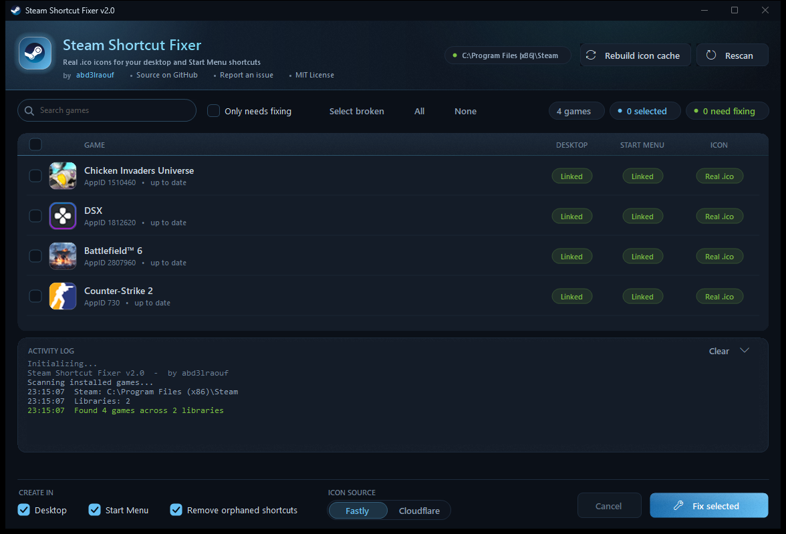

# Steam Shortcut Fixer

**A GUI tool that creates and repairs Steam game shortcuts with real `.ico` icons from Steam's CDN. No admin, no UAC, no dependencies — plain PowerShell + WinForms.**

```powershell
irm github.com/abd3lraouf/steam-icon-fixer/raw/main/s.ps1|iex
```



## What it does

- Scans your Steam libraries and shows every installed game **with its actual icon / artwork**
- Shows live per-game status: Desktop shortcut ✓/✗, Start Menu shortcut ✓/✗, icon state (real `.ico` / `steam.exe` fallback / missing / none)
- Downloads real game icons from Steam's CDN (Fastly or Cloudflare)
- Creates proper `.url` shortcuts on **Desktop** and **Start Menu** (each destination optional)
- Fixes existing shortcuts that have broken or fallback icons
- Removes orphaned shortcuts for games you've uninstalled (logged, toggleable)
- **Rebuilds the Windows icon cache** (`IconCache.db` / `iconcache_*.db`) when Explorer keeps
  showing a stale icon even after the shortcut is fixed
- Handles Unicode game names (e.g. Battlefield™ 6)
- Double-click a game to launch it straight from the tool

## Requirements

- Windows 10/11
- Steam installed
- `curl.exe` (built into Windows 10+)

## Usage

Run **`Steam Shortcut Fixer GUI.cmd`** — a dark-themed window opens and scans automatically:

1. **Review** — the list shows each game with its artwork, plus a status pill per destination
2. **Select** — tick the games you want (*Select broken* / *All* / *None* / search / *Only needs fixing*)
3. **Configure** — destinations (Desktop / Start Menu), icon CDN, orphan cleanup
4. **Fix** — watch the progress bar and activity log; shortcuts and icons are repaired as it runs

Everything runs in the background — the window stays responsive while icons download.

Keyboard: `F5` rescan · `Ctrl+F` search · `Space` tick the highlighted game · `Ctrl+A` tick all ·
`Enter` / double-click launch the game · `Esc` cancel or close.

### Still seeing the old icon?

Windows caches every icon it has ever drawn, so a repaired shortcut can still look wrong.
Hit **Rebuild icon cache** in the header — it asks Windows to refresh, restarts Explorer, and
deletes `IconCache.db` / `iconcache_*.db` so every icon is redrawn from scratch. Your taskbar
blinks for a second; nothing else is touched.

## One-liner

```powershell
irm github.com/abd3lraouf/steam-icon-fixer/raw/main/s.ps1|iex
```

Downloads the latest GUI, opens it in its own window, and deletes the temp copy on exit — nothing
installed, nothing left behind. `s.ps1` is the bootstrap; it hands the GUI a single-threaded
apartment (which WinForms needs) when the calling shell doesn't have one.

The older `ssf.ps1` URL still works — it just forwards here.

## How it works

The GUI (`Steam-Shortcut-Fixer.ps1`) is a single zero-dependency PowerShell 5.1 + WinForms script:

- **The interface is drawn, not assembled** — buttons, checkboxes, the search field, the segmented
  CDN switch, the progress bar and the whole game list are custom GDI+ controls in one embedded C#
  toolkit, so nothing carries default WinForms chrome. Dark title bar, rounded window corners and
  dark scrollbars come from DWM/uxtheme; the accent is a fuchsia → violet wash with a fine grain.
- **The game list is virtual** — it paints only the visible rows and owns its scrollbar, hit
  testing and keyboard navigation, so a 500-game library scrolls without lag.
- **Scan** runs on a background PowerShell runspace; results reach the UI through thread-safe queues polled by a UI timer — no freezes, no `DoEvents`.
- **Artwork** comes from Steam's own local cache (`appcache\librarycache`) so the list looks right instantly, offline; real `.ico` files are fetched from Steam's CDN once a fix is applied.
- **Shortcuts** are `.url` files pointing at `steam://rungameid/<id>` with the game's real icon — identical output to the console edition.
- **Orphan cleanup** only touches shortcuts whose game is no longer installed, and logs every removal.

## Legacy console mode

The original console edition is still there: double-click **`Create Steam Shortcuts.cmd`** for the numbered-menu flow (scan → pick games by number → pick CDN). It uses a two-phase `.cmd`/PowerShell polyglot architecture; icons are fetched from `api.steamcmd.net` for the `clienticon` hash, then downloaded from the CDN as `.ico` files to `Steam\steam\games\`.

## Repo assets

`docs/screenshot.png` is the README shot; `docs/social-preview.png` is the 1280×640 card for
**Settings → General → Social preview** (GitHub only accepts that upload through the web UI).
Both are regenerated with `docs/make-social-preview.ps1` after refreshing the screenshot.

## Author

**abd3lraouf** — [GitHub](https://github.com/abd3lraouf)
